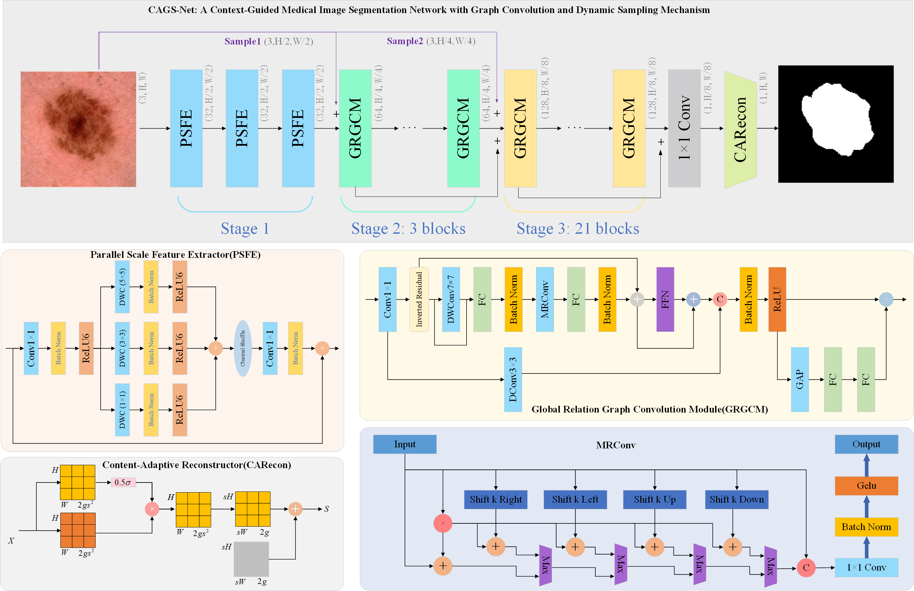
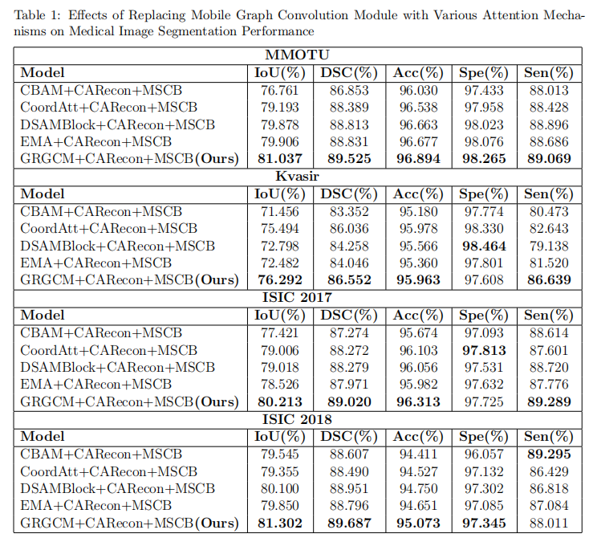
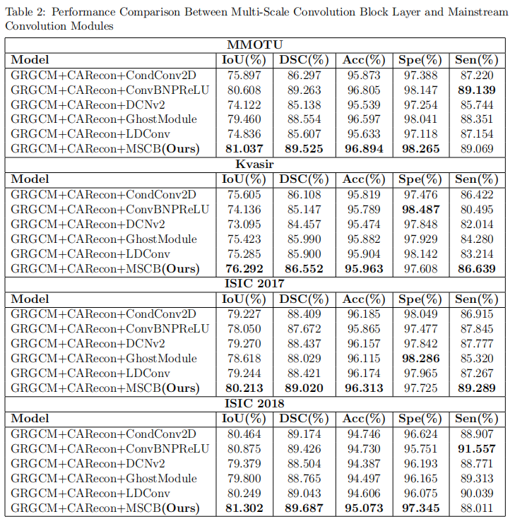
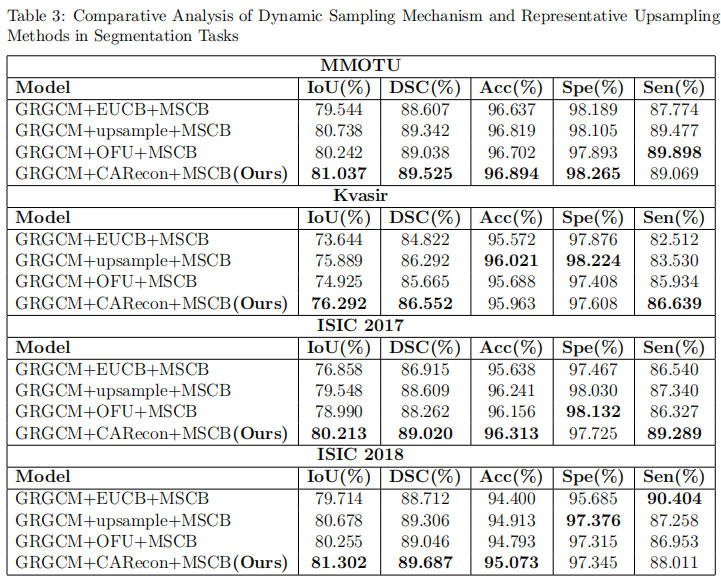
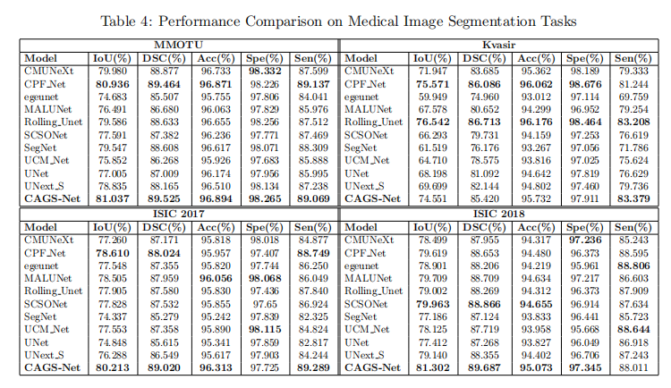
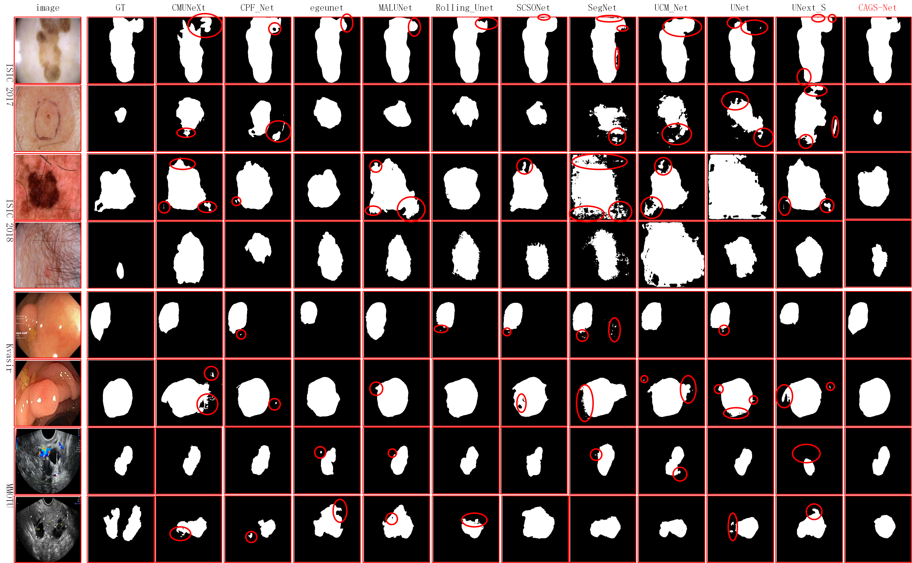

## CAGS-Net: Enhancing Medical Image Segmentation with Context-Guided Features and Dynamic Sampling

Yi Gao<sup>a</sup>, Haicheng Qu<sup>a</sup>*, Yao Wei<sup>a</sup>, Ying Wang<sup>b</sup>, Jinshi Bao<sup>a</sup>, Junyi Yue<sup>a</sup>

- <sup>a</sup>School of Software, Liaoning Technical University, Huludao, 125105, Liaoning, China
- <sup>b</sup>School of Electronic and Information Engineering, Liaoning Technical University, Huludao, 125105, Liaoning, China


<p align="center">
  
</p>
---

### 1. 实验数据集（全部开源）
#### 数据集结构
```bat
E:\CAGS-Net\data\
├── dataset_isic17\         # ISIC 2017 数据集
│   ├── train\
│   │   ├── images\         # 训练图像
│   │   │   └── ISIC_0000000.jpg         # 多个图像文件
│   │   └── masks\          # 训练掩码
│   │       └── ISIC_0000000.png         # 多个掩码文件
│   ├── val\
│   └── test\
├── dataset_isic18\         # ISIC 2018 数据集
│   ├── train\
│   ├── val\
│   └── test\
├── Kvasir\                 # Kvasir 数据集
│   ├── train\
│   ├── val\
│   └── test\
└── MMOTU\                  # MMOTU 数据集
    ├── train\
    ├── val\
    └── test\
```
#### 处理数据集
```bat
cd dataprepare
python dataprepare.py
```
#### 数据集来源
- ISIC 2017
  - Ruan, Jiacheng, et al. "EGE-UNet: an efficient group enhanced UNet for skin lesion segmentation." MICCAI, 2023.
  - GitHub：`https://github.com/JCruan519/EGE-UNet?tab=readme-ov-file`
  - 数据：`https://pan.baidu.com/share/init?surl=Y0YupaH21yDN5uldl7IcZA&pwd=dybm`

- ISIC 2018
  - Ruan, Jiacheng, et al. "EGE-UNet: an efficient group enhanced UNet for skin lesion segmentation." MICCAI, 2023.
  - GitHub：`https://github.com/JCruan519/EGE-UNet?tab=readme-ov-file`
  - 数据：`https://pan.baidu.com/share/init?surl=Y0YupaH21yDN5uldl7IcZA&pwd=dybm`

- Kvasir
  - Zhou, Tao, et al. "Cross-level feature aggregation network for polyp segmentation." Pattern Recognition 140 (2023): 109555.
  - GitHub：`https://github.com/taozh2017/CFANet`
  - 数据：`https://drive.google.com/file/d/1hzS21idjQlXnX9oxAgJI8KZzOBaz-OWj/view`
  - 数据：`https://drive.google.com/file/d/1hwirZO201i_08fFgqmeqMuPuhPboHdVH/view`

- MMOTU
  - Zhong, Jiahui, et al. "PMFSNet: Polarized multi-scale feature self-attention network for lightweight medical image segmentation." Computer Methods and Programs in Biomedicine 261 (2025): 108611.
  - GitHub：`https://github.com/yykzjh/PMFSNet`
  - 数据：`https://pan.baidu.com/s/10AT7fqgbK2s507tr1MfpTQ?pwd=mo3c`

---

### 2. 实验环境

#### 硬件

- CPU：Intel(R) Core(TM) i9-10900K
- GPU：NVIDIA TITAN RTX（1 张）

#### 软件与依赖

- PyTorch 历史版本对照：`https://pytorch.org/get-started/previous-versions/`
- PyTorch/Audio/Vision 离线包：`https://download.pytorch.org/whl/torch`

#### 环境配置步骤（Windows）

```bat
:: 进入 environments 目录后执行
conda create -n gy python=3.7.9 -y
conda activate gy

pip config set global.index-url https://mirrors.aliyun.com/pypi/simple/
pip install torch-1.13.1+cu116-cp37-cp37m-win_amd64.whl
pip install torchaudio-0.13.1+cu116-cp37-cp37m-win_amd64.whl
pip install torchvision-0.14.1+cu116-cp37-cp37m-win_amd64.whl
pip install -r gy_environments.txt
```

> 提示：请确保上述 whl 文件与 CUDA/系统版本匹配；若使用在线安装，请参考 PyTorch 官方指引选择合适命令。

---

### 3. 运行命令

#### 3.1 对比实验运行

```bat
for /L %i in (1,1,5) do (
    for %j in ( CMUNeXt CPF_Net egeunet MALUNet Rolling_Unet SCSONet SegNet UCM_Net UNet UNext_S ) do (
        for %k in (ISIC2017 ISIC2018 Kvasir MMOTU) do (
            python train.py --dataset %k --epochs 1 --batch_size 8 --network %j
        )
    )
)
```

#### 3.2 消融实验运行

- CARecon 上的消融实验

```bat
for /L %i in (1,1,5) do (
    for %j in (
        CAGSNet_GRGCM_EUCB_PSFE
        CAGSNet_GRGCM_OFU_PSFE
        CAGSNet_GRGCM_upsample_PSFE
    ) do (
        for %k in (ISIC2017) do (
            python train.py --dataset %k --epochs 1 --batch_size 8 --network %j
        )
    )
)
```

- GRGCM 上的消融实验

```bat
for /L %i in (1,1,5) do (
    for %j in (
        CAGSNet_CBAM_CARecon_PSFE
        CAGSNet_CoordAtt_CARecon_PSFE
        CAGSNet_DSAMBlock_CARecon_PSFE
        CAGSNet_EMA_CARecon_PSFE
    ) do (
        for %k in (ISIC2017) do (
            python train.py --dataset %k --epochs 1 --batch_size 8 --network %j
        )
    )
)
```

- PSFE 上的消融实验

```bat
for /L %i in (1,1,5) do (
    for %j in (
        CAGSNet_GRGCM_CARecon_CondConv2D
        CAGSNet_GRGCM_CARecon_ConvBNPReLU
        CAGSNet_GRGCM_CARecon_DCNv2
        CAGSNet_GRGCM_CARecon_GhostModule
        CAGSNet_GRGCM_CARecon_LDConv
    ) do (
        for %k in (ISIC2017) do (
            python train.py --dataset %k --epochs 1 --batch_size 8 --network %j
        )
    )
)
```

---

### 4. 实验结果与可视化

- 即将补充：包括定量指标表格（mIoU、DSC 等）与可视化示例图。

<p align="center">
  
</p>

<p align="center">
  
</p>

<p align="center">
  
</p>

<p align="center">
  
</p>

<p align="center">
  
</p>


---

### 5. 致谢与引用

本文借鉴项目
```bat
https://github.com/JCruan519/EGE-UNet?tab=readme-ov-file
https://github.com/wurenkai/UltraLight-VM-UNet
```
如在研究中使用本仓库代码或模型，请在论文中引用相关工作，并在合适位置致谢本项目。
